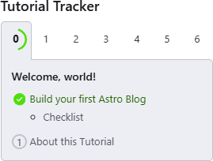
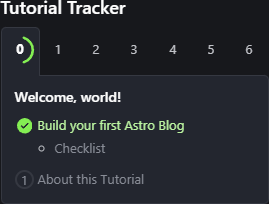
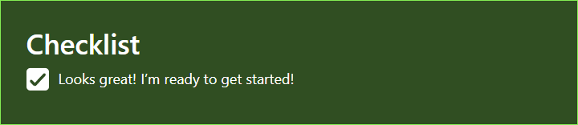
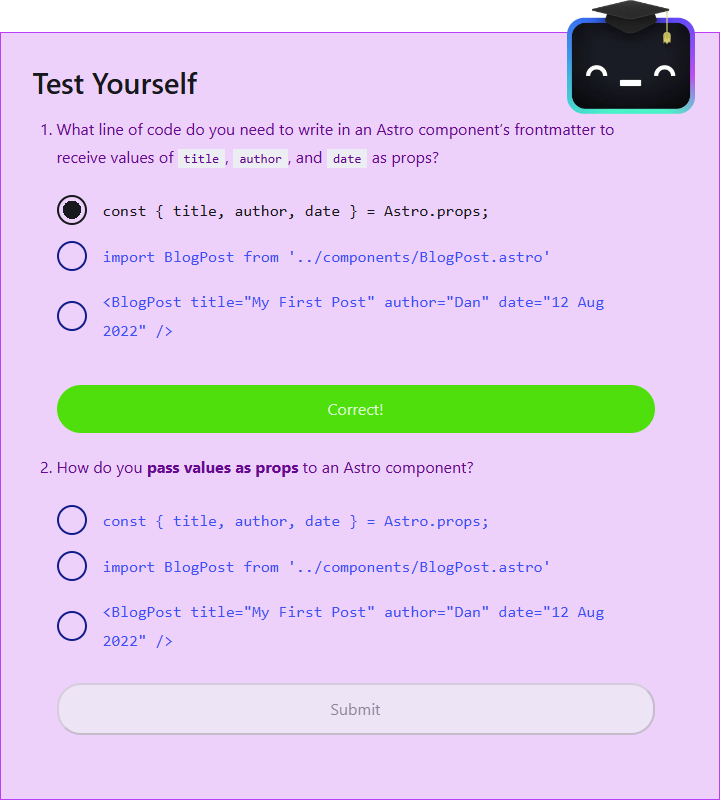

import { Aside, Icon, Steps, FileTree } from '@astrojs/starlight/components';
import { Image } from 'astro:assets';
import tailwindMark from '../../../assets/tailwindcss-mark.3c5441fc7a190fb1800d4a5c7f07ba4b1345a9c8.svg';

After having kicked the tires on Astro off and on over the past couple of months, I wanted to see if I could replicate the cool components that show up when you walk through the [*Build a Blog*](https://docs.astro.build/en/tutorial/0-introduction/) Astro Tutorial. I decided to both **build** <Icon name="seti:html" color="goldenrod" class='!inline-block' />, **demo** <Icon name="rocket" color="goldenrod" class='!inline-block' /> and **document** <Icon name="document" color="goldenrod" class='!inline-block' /> my approach in the Astro Starlight template. It makes for a nice "eat your own dog food" experience. Checkout my sample project to if you want to peruse the complete code.

<Aside type="note" title="Built with">
| <Icon name="astro" class='!inline-block' /> Astro | <Icon name="starlight" class='!inline-block' /> Starlight | <Image src={tailwindMark} alt="Tailwind CSS" class='!inline-block size-[1em]' /> Tailwind | <Icon name="mdx" class='!inline-block' /> MDX |
| --- | --- | --- | --- |
</Aside>

How am I going to build this? First of all, I decided *I wouldn't cheat*. I won't look at the code behind the components on Astro's site or in their GitHub repo. I will steal some styling using [Tailscan]() (a cool tool to inspect a page to see what Tailwind classes are being used), so that it hopefully will have *some* visual semblance of their design.

> *Dam it Jim, I'm a programmer, not a designer!*

Here's my plan:

<Steps>
1. *Spin up a new Astro project*

   ```powershell
   pnpm create astro@latest --template starlight
   ```

1. *Document my plan*

   You're reading this right now. Watch as I don my lab coat, eat my own dog food, and jot down my experiences in the process. It also seemed a good opportunity to take full advantage of various Astro and Starlight components that are already baked into the template.

   ```mdx
   import { Aside, Icon, Steps, FileTree } from '@astrojs/starlight/components';
   import { Image } from 'astro:assets';
   ```

1. *Attempt to go **Meta***

   I'll show you the details of my code as a "tutorial". So, whether you decide to follow along or just grab the code, you can at least see the fruits of my labour in my tutorial. Enjoy the show!
</Steps>

With that plan in mind, lets quickly think of the components that I'll need to build.

## The Experience

When you visit the Astro Tutorial, you encounter a series of components that make for pretty cool guides for people learning Astro. There's a set of "steps" in the tutorial and along the way you encounter "checklists" that highlight the key takeaways from each step.

| Tutorial Tracker | Checklists |
| --- | --- |
|   |  |

There's also a nice "Test Yourself" component that acts as a self-check on the main knowledge pieces covered in a given step.

| Test Yourself Sample | Houston The Student |
| --- | --- |
|  |  |

